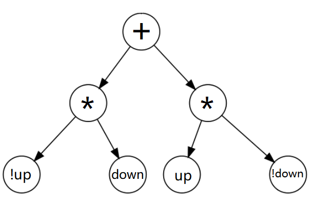
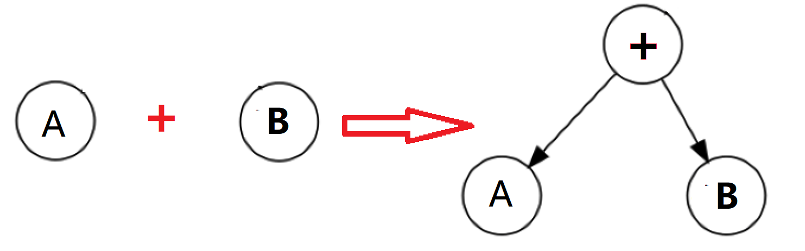
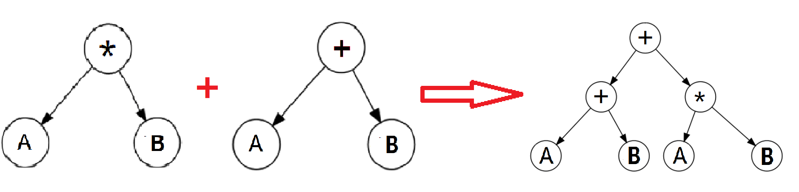
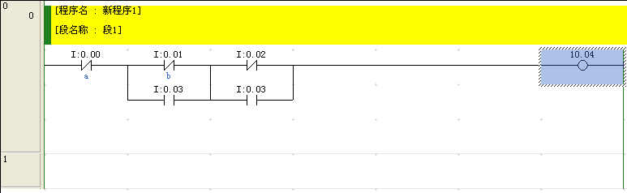

## PLC逻辑生成 - 内嵌领域专用语言(half)

### 想法来源

使用`CX-Programmer`来编写PLC(Programmable Logic Controller)的代码时, 有2种编写模式

* **梯形图** -- 图形化可视效果好但是编写效率低
* **助记符** -- 编写效率高但是可读性差

个人的编程习惯是使用**助记符**来编写PLC的代码, 但是在写代码的过程中遇到了很多困难, 比如

1. 很难知道自己之前写的代码是做什么的, 即**逻辑表达不清晰** -- 这一点可以通过使用梯形图查看进行缓解
2. **无法记住相应的寄存器**是做什么的, 比如用输入`0`来代表停止运行, 在后边的逻辑编写中可以想起我应该有一个寄存器是用来代表停止运行这件事情, 但是想不起对应的应该是哪个数字, 特别是有很多寄存器都有其相对应的数字的情况下 -- 如果能用单词, 比如`run`来代表这个数字, 即**使用变量**这个概念, 那将带来极大的方便, 当然`CX-Programmer`中也能使用字母来代表数字, 但是每次使用都比较麻烦
3. **修改复杂, 代码量大**, 写程序时需要管理的细节多, 编程复杂度高, 比如想表达`C`等于`A`异或`B`, 用基础的`LD, OR, AND`写出来很复杂, 即使需要的信息在形式上只有`C = A ^ B`
4. **加注释困难**, 在梯形图上的注释看起来很直观, 但是在用`CX-Programmer`的助记符时, 几乎无法加入注释, 这无疑对可读性有比较大的影响

基于以上几点, 以及在当前需要完成的实验中, 逻辑表达式大量存在的前提下, 我尝试着写一个小工具来辅助自己编写PLC代码, 主要是为了减少代码编写量, 以及增加代码的可读性, 以及提供良好的抽象. 联想到之前有了解和听过的知识: **C++运算符重载**和**表达式树**, 感觉貌似可行, 说不定可以实现, 于是开始构思和code.

学校PLC实验的环境是:

- 硬件 -- `CPM2*`
- 软件 -- `CX-Programmer`

### 实现 - step by step

这里需要读者

* PLC入门(知道至少10个指令)
* 对C++的运算符重载有了解
* 了解表达式树(expression tree), 可以在阅读过程中搜索资料自学

#### 对助记符的抽象

对于第一步的抽象针对下边这些指令, 由于是对于**逻辑表达式**的抽象, 所以只针对单个bit的运算, 比如输入端口`0,1,2`, 输出端口`1001,1002,1003`等单个bit的寄存器, 这里的抽象不适用于`DM`等由多个bit构成的寄存器.

| LD        | OUT        | AND        | OR        | ORLD      |
| --------- | ---------- | ---------- | --------- | --------- |
| **LDNOT** | **OUTNOT** | **ANDNOT** | **ORNOT** | **ANDLD** |

在PLC中, 如果想让输入`0`和输入`1`异或后输出到`1002`中, 

需要写这样的代码

```haskell
-- 示例PLC代码
LD 0
ANDNOT 1
LDNOT 0
ANDNOT 1
ORLD
OUT 1002
```

这5行代码中, 描述的信息是`1002 = !0 * 1 + 0 * !1`, 注意, 这里使用`*, +, !`来分别代表与, 或, 非. 如果在写代码的时候, 可以直接写`1002 = !0 * 1 + 0 * !1`而不是上边的5行代码, 在写逻辑表达式的时候效率会提高不少.

要用C++来编写这类代码, 第一步可以做什么呢? 我的想法是先实现上述表格中10条助记符的功能, 想把C++写成PLC是不可能的, 这辈子都不可能的, 也就只能`cout`呀这样子来产生PLC代码. 具体的一个例子是

```c++
void ld(int number)
{
    cout << "LD " << number << endl;
}
```

当想在PLC助记符中输入`LD 7`时, 我就可以在C++中调用`ld`这个函数, 具体是语句`ld(7)`, 然后当C++的程序运行后, 就会产生输出`LD 7`, 这样, 一个C++函数就和一行PLC助记符对应上了.

如法炮制, 对于PLC助记符`ANDNOT`和`ORLD`, 可以写为一个C++函数

```c++
void andnot(int number)
{
    cout << "ANDNOT " << number << endl;
}

// 注意, orld这个函数不接受参数
// 因为在PLC助记符中的ORLD也不接受参数
void orld() 
{
    cout << "ORLD" <<endl;
}
```

当在C++中调用函数`andnot(3000)`时, 会生成PLC助记符`ANDNOT 3000`.

于是对于表格中的那10条助记符, 都可以编写出一个C++的函数与其对应, 当C++程序运行完毕后, 产生相应的PLC助记符.

到这里, 前边的PLC示例代码, 可以用C++写成

```c++
ld(0);
andnot(1);
ldnot(0);
andnot(1);
orld();
out(1002);
```

这样弄有什么好处呢? 代码行数还是一样呀? 嗯, 确实目前没多大好处, 不过依赖于C++, 我们目前已经可以用变量来代表具体的数字, 以及对代码添加注释了, 就像这样

```C++
int up = 0;
int down = 1;
int wait = 1002;
// 以下实现 wait = up 异或 down
// 即 wait = !up * down + up * !down
ld(up);
andnot(down);
ldnot(up);
andnot(down);
orld();
out(wait);
```

注意第二行注释, 我们的目的是使得这段代码能像`wait = !up * down + up * !down`这样编写, 这也是接下来的工作.

#### 用* + ! 来写表达式

##### 表达式树 -> PLC代码

到这里就需要一些表达式树的知识了

表达式树相关的内容读者可以参考[Binary_expression_tree](https://www.wikiwand.com/en/Binary_expression_tree)

`wait = !up * down + up * !down`的表达式树为



注意到非叶子节点都是运算符, 叶子节点要么是具体的变量, 要么是这个变量的非. 如果在程序中有这样一颗表达式树, 怎样让它转为具体的PLC助记符代码呢? 

这里直接给出答案, 即**对表达式树进行后序遍历, 会碰到2类节点, 叶子和非叶子节点; 如果遍历的当前节点为非叶子节点, 就输出`ORLD或者ANDLD`, 具体是碰到`*`就输出`ANDLD`, 碰到`+`就输出`ORLD`; 如果遍历的当前节点为叶子节点, 就`LD或LDNOT`这个叶子节点, 如果比如说, 如果碰到`up`就执行`ld(up)`, 碰到`!up`就执行`ldnot(up)`**

所以, 这颗表达式树在后序遍历的执行顺序上, 会执行

```haskell
ldnot(up);
ld(down);
andld();
ld(up);
ldnot(down);
andld();
orld();
```

生成的PLC代码为

```haskell
LD 0
LDNOT 1
ANDLD
LDNOT 0
LD 1
ANDLD
ORLD
```

看着代码有些不对劲, 因为少了`OUT`, 但是没关系, 在C++里再加入一句`out(wait)`就行了.

##### C++表达式 -> 表达式树

现在知道了一颗表达式树如何转为相同逻辑的PLC代码, 那么主要的问题就是怎么生成这颗表达式树了.

这时候需要引入数据结构的知识, 以及C++ (换为任意一门其它的编程语言也可以, 只要有重载这类操作) 的运算符重载了.

从表达式树来看, 需要重载的运算符仅有3个, 即`!, *`和`+`, 这里为了简洁性先不考虑`!`. 我们知道一颗表达式树可以仅由单个叶子构成, 那就从这单个叶子开始吧, 假设我们有两颗表达式树`A`和`B`, 现在知道`C = A * B`, 怎么生成`C`对应的表达式呢? 示例图如下.


如果要`C = A + B也是类似的原理`



但是如果要`C = (A * B) + (A + B)`呢? 只需要再进行组合就行了.如下图



具体的在C++的操作涉及到二叉树的合并, 即将**运算符左边和右边分别当成左孩子和右孩子, 运算符当成树根节点**.这里只做原理性的概述.

还有`!`这个符号的重载, 当`!`作用到这颗表达式树的时候, 由布尔运算中的德摩根定律, 可以对二叉树进行一次遍历, 将所有非叶子节点取成想法的运算, 即`* -> +`和`+ -> *`, 碰到非叶子节点就对节点取反, 值得注意的是, 可以用`pair<bool,int>`来表示一个叶子节点.

具体的代码在编写好的头文件`PLC.h`中, 可以采用很多种方法来实现. 我在实现在有很多缺陷, 很多可以改进的地方.

### 具体使用方法

上述为原理的讲述. 

严格来说这并不能算是一个内嵌领域专用语言(DSL), 因为缺少了很多东西, 但是实在是不知道把这个工具归类到哪里, 于是选了和它看起来最接近的领域, 即**领域专用语言(domain specific language / DSL)**, 由于是在C++内部实现的, 所以加上了**内嵌**这2个字.

这里开始, 是如何调用API来使用.

需要声明PLC表达式, 然后用PLC表达式进行运算.

* `*`代表`and`
* `+`代表`or`
* `!`代表取反
* `>>`代表将左边表达式值输出到右边

具体代码如下

```c++
#include<iostream>
#include "PLC.h" // 包含PLC.h头文件, 放在程序相同目录下
using namespace std;

// 创建PLC表达式
PLCEXP a = 0; 
PLCEXP b = 1;
PLCEXP c = 1002;

int main()
{
    // 写逻辑运算的表达式
    a * !b + !a * b >> c; // 将 a * !b + !a * b 的结果输出到 c中
    return 0;
}
```

#### 效果

##### 生成的代码

```haskell
LD 0
LDNOT 1
ANDLD
LDNOT 0
LD 1
ANDLD
ORLD
OUT 1002
```

##### 梯形图

.PNG)

### 更复杂的逻辑表达式

实现`!(A+B * !D+C * !D)`输出到`E`.

我们知道`!(A+B * !D+C * !D) = !A * !(B * !D) * !(C * !D) = !A * (!B + D) * (!C + D) `

```c++
#include<iostream>
#include "PLC.h" // 包含PLC.h头文件, 放在程序相同目录下
using namespace std;

// 创建PLC表达式
PLCEXP A = 0;
PLCEXP B = 1;
PLCEXP C = 2;
PLCEXP D = 3;
PLCEXP E = 1004;
int main()
{
    // 写逻辑运算的表达式
    !(A+B * !D+C * !D) >> E;
    return 0;
}
```

##### 生成的代码

```haskell
LDNOT 0
LDNOT 1
LD 3
ORLD
ANDLD
LDNOT 2
LD 3
ORLD
ANDLD
OUT 1004
```

##### 梯形图



